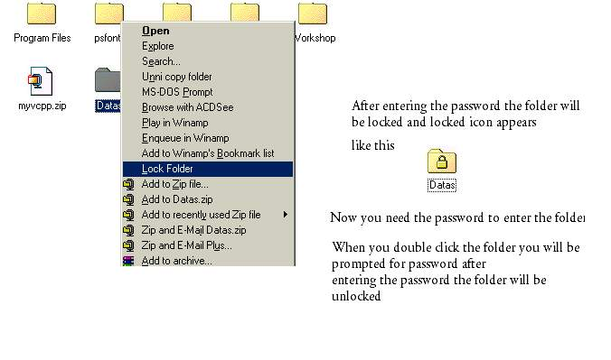



## Folder Protect \_Errors Fixed

### Description

This is a super program using this program you can password protect folders

After Locking a folder when you double click the folder you will be prompted for password

This program prevents from viewing th contents of the folder but the folder can be deleted

I am now trying to protect thefolder from deletion if any one found it please send it to me

It has one error before now it is fixed(the error was lock folder does not appear in the context menu)

Don't forgot to vote for me
 
### More Info
 

             |
---                |---
**Submitted On**   |2003-03-16 21:25:44
**By**             |[Priyan R](https://github.com/Planet-Source-Code/PSCIndex/blob/master/ByAuthor/priyan-r.md)
**Level**          |Beginner
**User Rating**    |4.2 (67 globes from 16 users)
**Compatibility**  |VB 5\.0, VB 6\.0
**Category**       |[Complete Applications](https://github.com/Planet-Source-Code/PSCIndex/blob/master/ByCategory/complete-applications__1-27.md)
**World**          |[Visual Basic](https://github.com/Planet-Source-Code/PSCIndex/blob/master/ByWorld/visual-basic.md)
**Archive File**   |[Folder\_Pro1561173172003\.zip](https://github.com/Planet-Source-Code/priyan-r-folder-protect-errors-fixed__1-44063/archive/master.zip)

